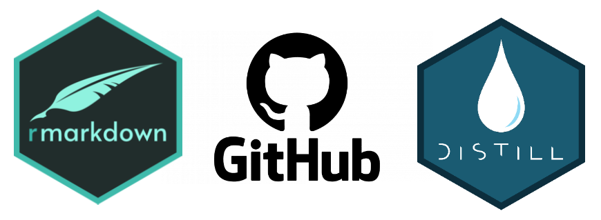

```{r setup, include=FALSE}
knitr::opts_chunk$set(echo = FALSE)

# Learn more about creating websites with Distill at:
# https://rstudio.github.io/distill/website.html

# Learn more about publishing to GitHub Pages at:
# https://rstudio.github.io/distill/publish_website.html#github-pages

```


## Introduction

Having your own website is like having a digital scientific ‘business card.’ Perhaps you do not know where to start, or perhaps you started but then got stuck? In this workshop, you will create your very own professional website using [R Markdown](https://rmarkdown.rstudio.com/) and [Distill](https://rstudio.github.io/distill/). No previous programming skills are required; you will start with a template, and then, step-by-step, add to this website template to represent you, your science, your teaching, your outreach activities, etc. You will also learn how and where to host your website. This website is a simple example of how your own website in [Distill](https://rstudio.github.io/distill/) could look like!

## Preparations for the workshop
For the workshop, there are some **simple prerequisites**. Please make sure all the following points are ready on your laptop **before** you come to the workshop.

  1. [Install R and RStudio](https://www.rstudio.com/products/rstudio/download/)
  2. Install the the following packages in RStudio:
  
```{r, eval=FALSE, echo=TRUE}
install.packages(c("distill", "rmarkdown", "postcards"))
```  
  
  3. [Create a GitHub account](https://github.com/join)
  4. [Install GitHub Desktop](https://desktop.github.com/)

On the day of the workshop, **bring your laptop** and **any material you want on your website** (photo, text about you, your project analyses in R, [instructions for making bagels](https://stats.andrewheiss.com/bread/bagels.html) etc..).

If you have any trouble with the preparations, please send [Gayoung](g.son@unibas.ch) an email!

