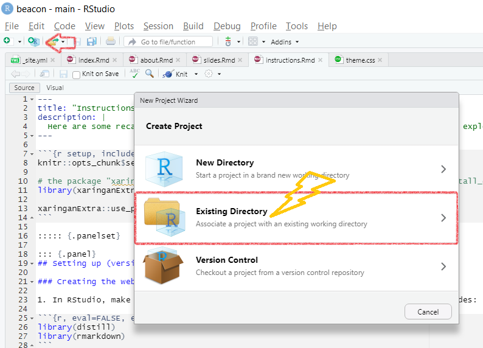

```{r setup, include=FALSE}
knitr::opts_chunk$set(echo = FALSE)

# the package "xaringanExtra" is needed to set up panels. Download here: devtools::install_github("gadenbuie/xaringanExtra")
library(xaringanExtra)

xaringanExtra::use_panelset()
```

## Setting Up
::::: {.panelset}

::: {.panel}
[Version 1]{.panel-name}

### Creating the website template on your computer

1. In RStudio, make sure the following packages are loaded by running the following codes:  
  
```{r, eval=FALSE, echo=TRUE}
library(distill)
library(rmarkdown)
```  
<aside>  
The most common errors are solved by reinstalling R and RStudio, or updating R. 
Maybe you need to install the newest version of the packages! Otherwise, google :smile:
</aside>  

2. Make a new R Project by clicking on the *New Project* button.
{width=700px}

3. Click on *New Directory*, than select *Distill Website* from the list.

4. Give your Website a directory name (a.k.a. name the folder), the title of your website (can be changed later) and check the box to *configure for Github Pages*! Now you have created a basic template. 
Make sure to save your .Rmd (R Markdown) files and `render_site()`, so that your .Rmd will be made into .html.
<aside>
Instead of `render_site()`, you can also click on **:hammer: Build Website**.
</aside>

### Uploading your website on GitHub

Your website template is there, but no one see it yet, because it is not "in the cloud". For this, we will use GitHub Pages.

1. Go to GitHub and *create a new repository*. You can click on the *plus* button on the top right corner. 

2. Give your new repository a name, add a README file and .gitignore like shown in the screenshot below. Then create!
{width=700px}

3. Go to the *Settings* of your repository, click on *Pages* and change the *Branch* to the *docs* folder and save.This tells GitHub where to find your .html files.
{width=700px}

4. In your GitHub Desktop, [*clone*](https://docs.github.com/en/desktop/contributing-and-collaborating-using-github-desktop/adding-and-cloning-repositories/cloning-and-forking-repositories-from-github-desktop#cloning-a-repository) your new repository onto your laptop. 

5. Move all the *contents* of your basic template website into the cloned folder! 
<aside>  
Make sure you don't copy the folder but only the contents, also the hidden ones!
</aside>
  
6. In your GitHub Desktop, [*commit* and *push*](https://docs.github.com/en/desktop/contributing-and-collaborating-using-github-desktop/making-changes-in-a-branch/committing-and-reviewing-changes-to-your-project#write-a-commit-message-and-push-your-changes)!
  
Congratulations, you have made your website! :sparkles:
:::

::: {.panel}
[Version 2]{.panel-name}

A second, more *elegant* version of creating a website in GitHub, without having to copy your website template into the repo. This way will allow you to create an R Project *directly* inside your repository.

1. Create a new repository in GitHub, configure it for GitHub Pages in the setting and clone it onto your laptop.
<aside>
The instructions are in **Setting up (version 1)**.
</aside>

2. Open RStudio and create a new project, however, this time click the option **Existing Directory**, as shown in the screenshot below. 
{width=700px}
Make sure to set your Project Working Directory to **the cloned repository folder** on your laptop!

3. Now you will have a blank R Project with no Distill Website Template, but don't fret! Just type the following line into the console, then enter your website title! Now you have a website template. Make sure to save and `render_site()`.

```{r create, eval=FALSE, echo=TRUE}
distill::create_website(dir = getwd(), gh_pages = TRUE)
```

4. Now the only thing left is to [*commit* and *push*](https://docs.github.com/en/desktop/contributing-and-collaborating-using-github-desktop/making-changes-in-a-branch/committing-and-reviewing-changes-to-your-project#write-a-commit-message-and-push-your-changes) your changes in GitHub Desktop.
  
Congratulations! You have made your website. :sparkles:  
:::

:::::

## Additional Links

Now the only thing left is to personalize your website and to add content! Please check out the official [Distill website](https://rstudio.github.io/distill/website.html) for great step-by-step instructions on how to build the site. 
Please check out the tutorial from the [Distillery](https://distillery.rbind.io/posts/2021-03-16-postcards-distill/) on how to make an *about me* page.
If you want to understand more of R Markdown, we recommend this webinar from Alison Hill and Desirée De Leon.


<p><a href="https://www.rstudio.com/resources/webinars/sharing-on-short-notice-how-to-get-your-materials-online-with-r-markdown/?wvideo=6l7vg4inx5"></a></p><p><a href="https://www.rstudio.com/resources/webinars/sharing-on-short-notice-how-to-get-your-materials-online-with-r-markdown/?wvideo=6l7vg4inx5">Sharing on Short Notice: How to Get Your Materials Online With R Markdown - RStudio</a></p>