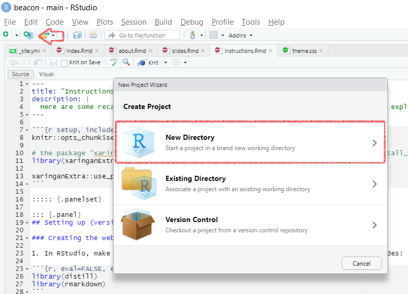
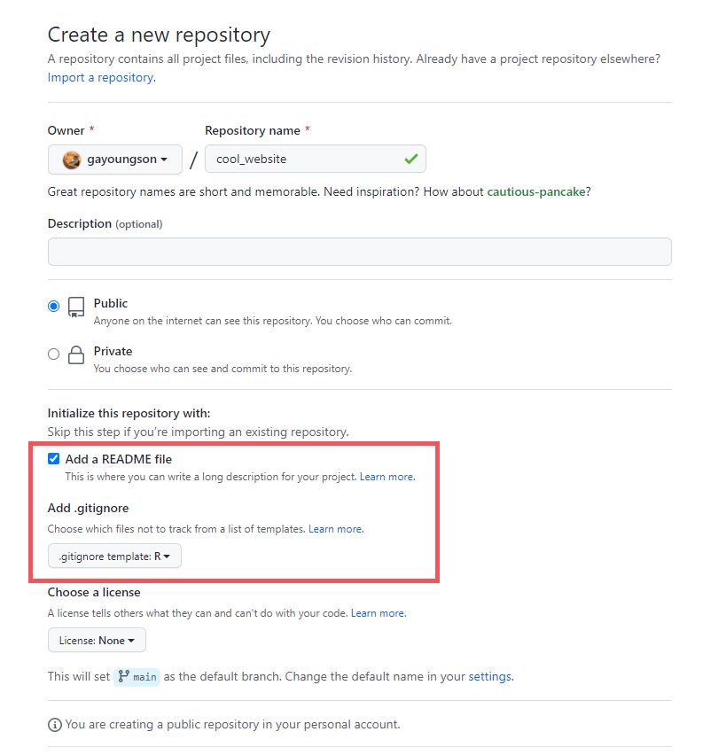
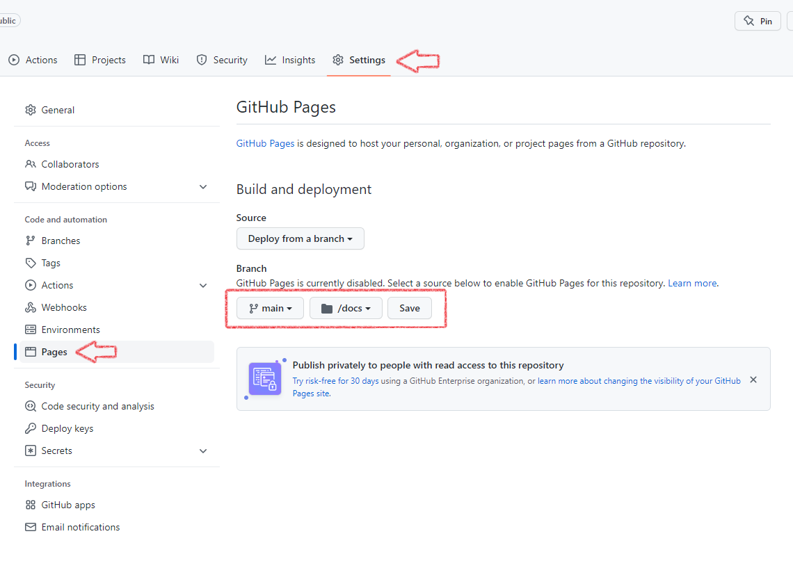

```{r setup, include=FALSE}
knitr::opts_chunk$set(echo = FALSE)

# the package "xaringanExtra" is needed to set up panels. Download here: devtools::install_github("gadenbuie/xaringanExtra")
library(xaringanExtra)

xaringanExtra::use_panelset()
```

::::: {.panelset}

::: {.panel}
## Setting up (version 1){.panel-name}

### Creating the website template on your computer

1. In RStudio, make sure the following packages are loaded by running the following codes:  
  
```{r, eval=FALSE, echo=TRUE}
library(distill)
library(rmarkdown)
```
<aside>  
The most common errors are solved by reinstalling R and RStudio, updating R, or reinstalling and loading the packages. Check if all your brackets are correct! Otherwise, google everything ;)
</aside>  
    
2. Make a new R Project by clicking on the *New Project* button.
{width=700px}

3. Click on *New Directory*, than select *Distill Website* from the list.

4. Give your Website a directory name (a.k.a. name the folder), the title of your website (can be changed later) and check the box to *configure for Github Pages*! Now you have created a basic template. 

### Uploading your website on GitHub

Your website template is there, but no one see it yet, because it is not "in the cloud". For this, we will use GitHub Pages.

1. Go to GitHub and *create a new repository*. You can click on the *plus* button on the top right corner. 

2. Give your new repository a name, add a README file and .gitignore like shown in the screenshot below. Then create!
{width=700px}

3.Go to the *Settings* of your repository, click on *Pages* and change the *Branch* to the *docs* folder and save.This tells GitHub where to find your .html files.
{width=700px}

4. In your GitHub Desktop, *clone* your new repository onto your laptop. 

5. Move all the *contents* of your basic template website into the cloned folder! 
<aside>  
Make sure you don't copy the folder but only the contents, also the hidden ones!
</aside>
  
6. In your GitHub Desktop, *commit*, then push! Congratulations, you have made your website!

:::

::: {.panel}
## Setting up (version 2)
TBD
:::

:::::